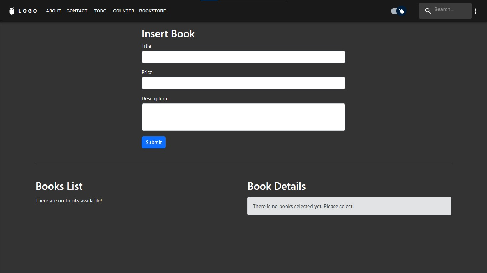
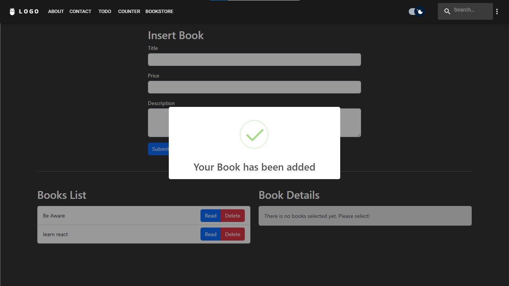
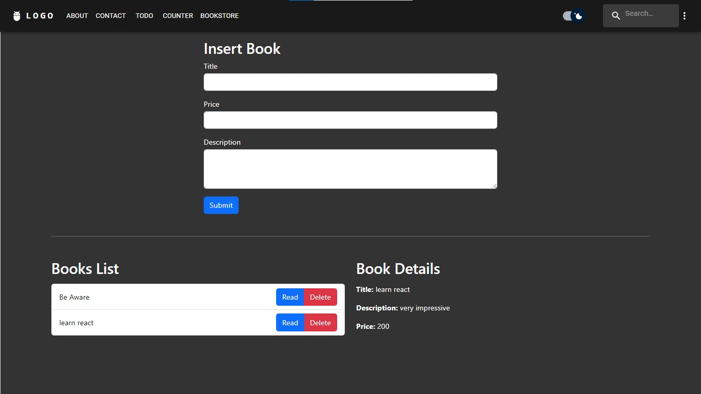
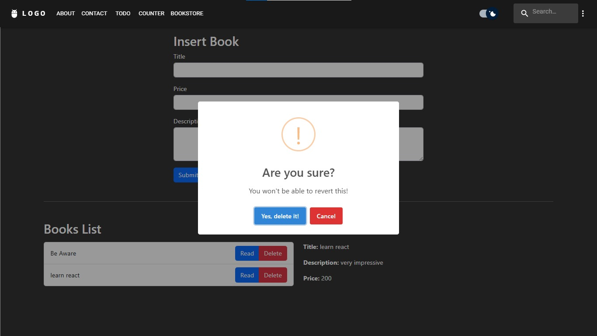
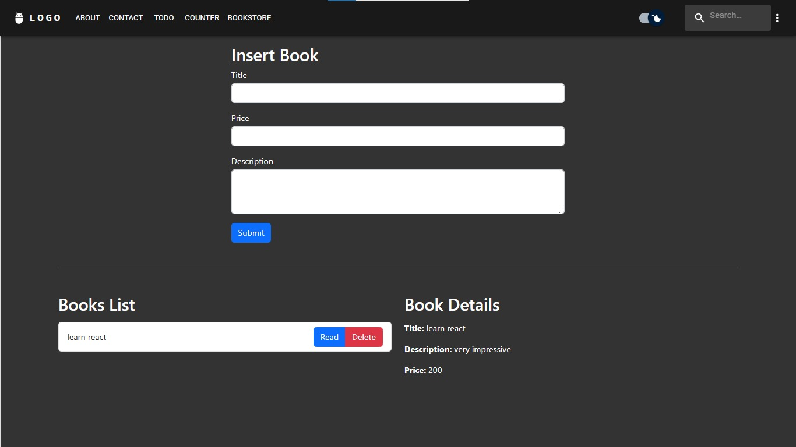

# Books Store

This is a sample website for a books store, built with React TypeScript, for practicing Redux Toolkit and fetching data from a third-party API. It includes the following features:

## Demo

## Features
### Add Book
- Users can add a new book to the book store by filling out the book information in the form and clicking "Submit". The new book will be added to the list of books and persisted to the fake JSON server.

### Delete Book
- Users can delete a book from the book store by clicking the "Delete" button next to the book they want to remove. The book will be removed from the list of books and deleted from the fake JSON server.

### Read Book Info
- Users can click on "Read" button next to the book to view more information about the book, including the author, title, description and price.

## Tools
- APIs using Axios
- `dispatch` and `useSelector` hooks from Redux Toolkit
- `AsyncThunkAction`, `extraReducers`, `reducers`, and `createSlice` from Redux Toolkit
- Multi reducers
- Fake JSON server

